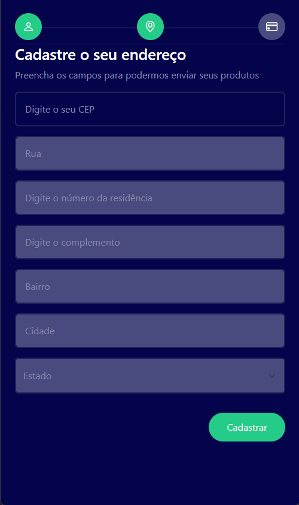
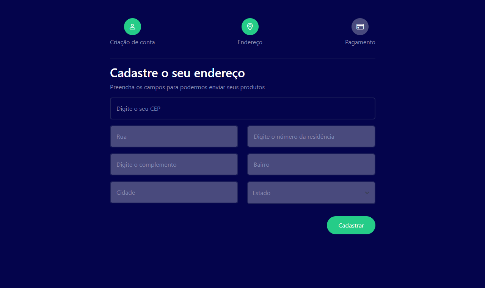

# 📍 Consulta de Endereço Dinâmica (ViaCEP API)

Este projeto é um formulário de endereço inteligente que utiliza a **Fetch API** do JavaScript para buscar dados de localização em tempo real a partir do CEP informado.

## 🚀 Funcionalidades
- **Preenchimento Automático**: Busca Rua, Bairro, Cidade e Estado instantaneamente.
- **Validação de Entrada**: Bloqueio de caracteres não numéricos via Regex.
- **UX/UI**: Feedback visual com Loader enquanto a API processa a requisição.
- **Responsividade**: Interface adaptável para dispositivos móveis utilizando Bootstrap 5.

## 🛠 Tecnologias Utilizadas
- **JavaScript (ES6+)**: Uso de `async/await` e manipulação de DOM.
- **Bootstrap 5**: Estruturação de layout (Grid System) e componentes de formulário.
- **API ViaCEP**: Serviço externo para consulta de dados postais brasileiros.
- **HTML5 & CSS3**: Estrutura e ajustes finos de design.

## 💡 Aprendizados Técnicos
Embora o foco principal tenha sido o domínio do **JavaScript Assíncrono**, este projeto serviu como uma introdução prática ao **Bootstrap**, permitindo entender como as classes utilitárias podem acelerar o desenvolvimento de interfaces sem a necessidade de escrever CSS complexo manualmente.

## 🏁 Como testar o projeto
1. Clone este repositório.
2. Abra o arquivo `index.html` em seu navegador.
3. Digite um CEP válido (ex: `01001-000`) e veja a mágica acontecer!
